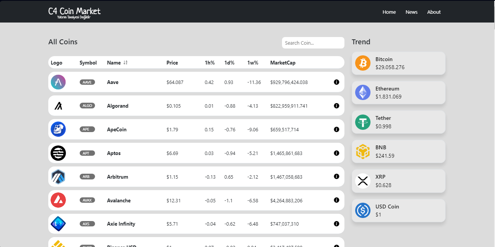

## C4 Coin Market

-  https://api.coinstats.app/public/v1/coins?skip=0 adresi API olarak kullanılmıştır. 
- Tüm coinler; logo, isim, sembol, fiyat, saatlik-günlük-haftalık değişim, piyasa değeri(marketcap) bilgileri ile listelenmiştir.
- Sayfanın sağında en popüler 6 coin yazdırılmıştır.
- Coin arama, isme ve fiyata göre artan-azalan sıralama yapılmaktadır. 
- İlgili coinin detay sayfasında API'de bulunan tüm veriler kullanılmıştır. 
- Grafik için ise https://api.coingecko.com/api/v3/coins/${coinName}/market_chart?vs_currency=usd&days=7 apisi kullanılarak 7 günlük veriler alınmış ve grafik olarak bastırılmıştır.

## Kullanılan teknolojiler
- React
- Router
- Styled Components
- Lightweight Charts

